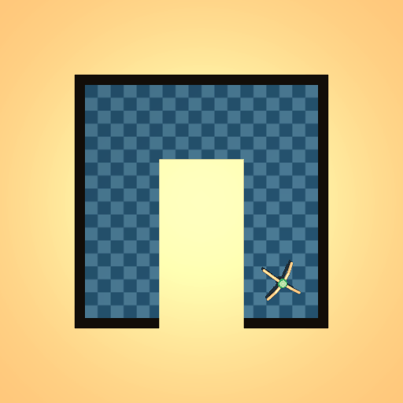

<h1>ISSP</span></h1>

A PyTorch implementation of "Rethinking Offline Reinforcement Learning with Implicit State-State Planning".


## Evaluation Video

<div style="display: flex; flex-wrap: wrap; gap: 10px;">
  <div style="text-align: center;">
    
    <p>Halfcheetah Random</p>
  </div>
  <div style="text-align: center;">
    
    <p>Halfcheetah Medium</p>
  </div>
  <div style="text-align: center;">
    
    <p>Halfcheetah Medium Replay</p>
  </div>
  <div style="text-align: center;">
    
    <p>Halfcheetah Medium Expert</p>
  </div>
  <div style="text-align: center;">
    
    <p>Halfcheetah Expert</p>
  </div>
</div>


<div style="display: flex; flex-wrap: wrap; gap: 10px;">
  <div style="text-align: center;">
    
    <p>Hopper Random</p>
  </div>
  <div style="text-align: center;">
    
    <p>Hopper Medium</p>
  </div>
  <div style="text-align: center;">
    
    <p>Hopper Medium Replay</p>
  </div>
  <div style="text-align: center;">
    
    <p>Hopper Medium Expert</p>
  </div>
  <div style="text-align: center;">
    
    <p>Hopper Expert</p>
  </div>
</div>

<div style="display: flex; flex-wrap: wrap; gap: 10px;">
  <div style="text-align: center;">
    
    <p>Walker2d Random</p>
  </div>
  <div style="text-align: center;">
    
    <p>Walker2d Medium</p>
  </div>
  <div style="text-align: center;">
    
    <p>Walker2d Medium Replay</p>
  </div>
  <div style="text-align: center;">
    
    <p>Walker2d Medium Expert</p>
  </div>
  <div style="text-align: center;">
    
    <p>Walker2d Expert</p>
  </div>
</div>

<div style="display: flex; flex-wrap: wrap; gap: 10px;">
  <div style="text-align: center;">
    
    <p>AntMaze Umaze</p>
  </div>
  <div style="text-align: center;">
    
    <p>AntMaze Umaze Diverse</p>
  </div>
  <div style="text-align: center;">
    
    <p>AntMaze Medium Play</p>
  </div>
  <div style="text-align: center;">
    
    <p>AntMaze Medium Diverse</p>
  </div>
</div>

<div style="display: flex; justify-content: center; gap: 10px;">
  <div style="text-align: center;">
    
    <p>AntMaze Large Play</p>
  </div>
  <div style="text-align: center;">
    
    <p>AntMaze Large Diverse</p>
  </div>
</div>


----

## Getting started

We provide requirements and examples on how to train and evaluate ISSP agents. 

### Preparing

PyTorch == 1.10  
MuJoCo == 2.00  
mujoco-py == 2.0.2.8  
gym == 0.20  
d4rl == 1.1

### Training

See below examples on how to train OBAC on a single task (e.g. antmaze-large-diverse-v2).

```python
python main.py --env antmaze-large-diverse-v2
```
We recommend using default hyperparameters. See `utilis/default_config.py` for a full list of arguments.
